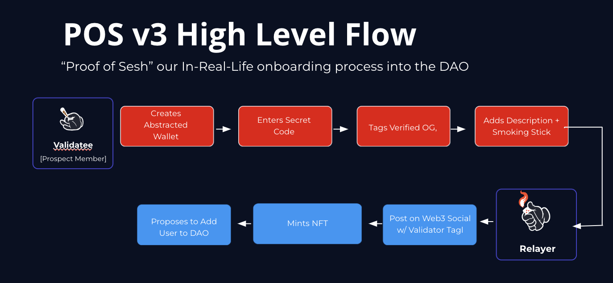

# 💨 Proof of Sesh Explained

Proof of Sesh is simple. A member IRL smokes you out and you tag them to mint a NFT on-chain to vote in the DAO.

Proof of Sesh consensus Mechanism for validating new "nodes" _aka members_ to the BluntDAO

1. **Optimistic Rollup**: A validator on the Blunt Network (current BluntDAO members) initiates "Proof of Sesh" by rolling up a blunt
2. **Proof of Burn**: Light Blunt
3. **Init:** Begin rotation with current validators
4. **Create Tokin':** As rotation continues, have the potential validator download a Web3 wallet based on respective chain (Ex; Phantom (ios) Slope (android) for Solana or Metamask for EVM chains) or via telegram if abstracted
5. **Validation**: Validate new member via "Proof of Sesh", **in-real-life** verification, see reasonable inhale and exhale of Blunt
6. **Request for Blunt (RFB)**:&#x20;
   1. Server: mints NFT, posts on Web3 social, and makes proposal to add in the DAO
   2. OLD - Go to [BluntDAO.com](http://bluntdao.com/), click discord icon, paste Web3 wallet address (Ex; Solana or Ethereum) in the #support channel. Then have your validator respond to you address w "Proof of Sesh'd". A validator will then send $BLUNT and respond with "Validated"

<figure><figcaption></figcaption></figure>

## How to Vote in DAO


[voting-in-the-dao.md](voting-in-the-dao.md)


Previous article covering proof of sesh [https://medium.com/@bluntdao/proof-of-sesh-explained-bluntdao-19ecd8479750](https://medium.com/@bluntdao/proof-of-sesh-explained-bluntdao-19ecd8479750)

