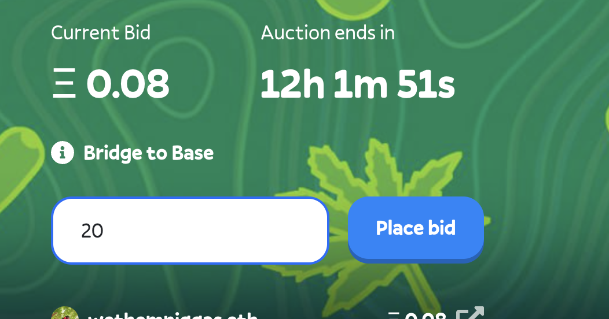
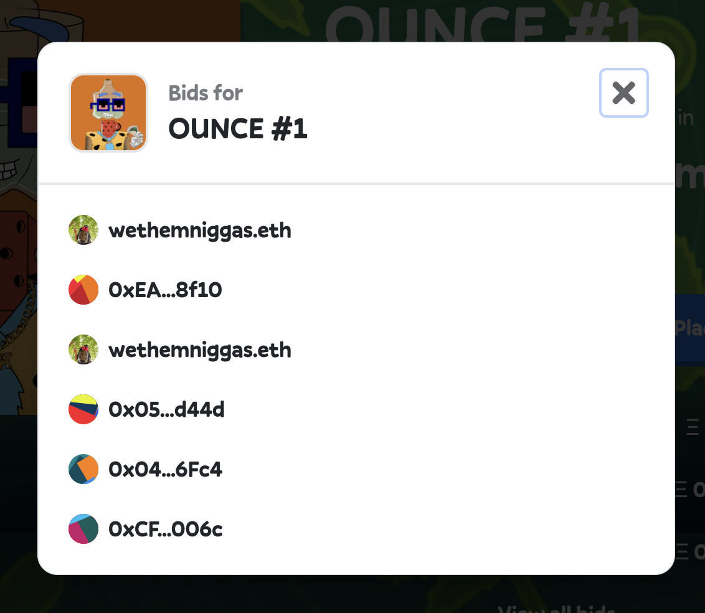

# 🙋‍♂️ Bidding on the Collection

We call it an ounce because generally we want the price to be around an OUNCE so we can theoretically have an OUNCE in bound into the treasury a day.

## Rules of Bidding

* Its around $0.01 to put in a bid (based on the transaction fees on [Base](https://www.base.org/))
* The NFT Collection is on Base and bids are done with ETHEREUM on Base the native gas of the L2. You can bridge directly from Ethereum mainnet using [the bridge](https://bridge.base.org/deposit), or get ETH on Base directly from the Coinbase Exchange.&#x20;
* The min bid 0.021 ETH&#x20;
* The same account cannot outbid itself.

<figure><figcaption>
Placing a bid on blunts.wtf
</figcaption></figure>

You can also view past auctions by viewing last auctions. 

<figure><figcaption>
0.021 ETH on base is minimum amount for lowest bid
</figcaption></figure>

## Settling the Auction

At the end of the auction anyone can settle the auction to award the NFT to the highest bidder and trigger the next auction.


Note, that this is a no royalty collection and the treasury doesn't benefit from secondary sales.  For more information on [secondary sales](secondary-sales.md)


We also prefer that you bid through the [https://blunts.wtf](https://blunts.wtf) gateway

