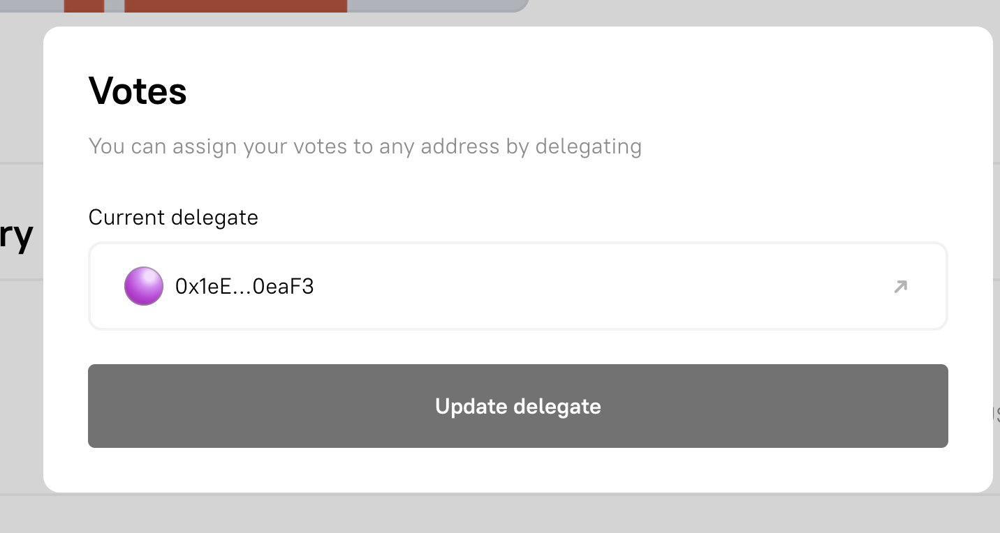
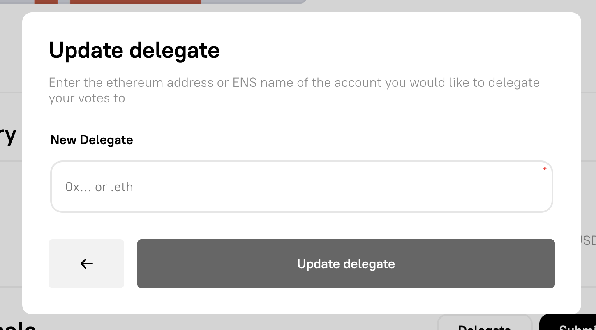

# ⚖️ Voting on Proposal

You can vote on a proposal with your OUNCE NFT.

[bluntdao.org/vote-fund ](https://bluntdao.org/vote-fund)is the short link to voting on this


It requires a small amount of gas (ETH on BASE) to confirm transactions


## How to Delegate Votes

Delegating a vote is a way to get another account to vote on your behalf without losing ownership of your NFT.

Next to submit proposal their is delegate vote. All you need to do is specify which address

<figure><figcaption>
delegate
</figcaption></figure>

 

<figure><figcaption>
shows current delegate
</figcaption></figure>

 

<figure><figcaption>
add update delegate
</figcaption></figure>

